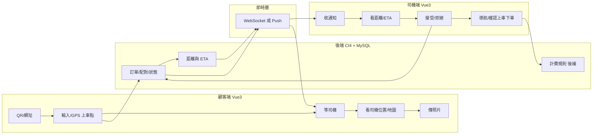

# 派遣系統可行性評估

依 [派遣.md](派遣.md) 所列條件，**可以建構出指定功能的系統**。技術棧與需求皆屬常見組合，無根本性障礙，僅需在即時通訊、地圖與計費規則上做明確選型與補齊。

---

## 可行性總覽

| 需求區塊                         | 可行性 | 說明                          |
| ---------------------------- | --- | --------------------------- |
| 環境（Vue3 / CI4 / MySQL / 瀏覽器） | 可行  | 常見組合，生態成熟                   |
| 顧客進入（QR / 網址）、地點輸入 / GPS     | 可行  | 瀏覽器 Geolocation API + 網址/QR |
| 通知司機、距離與 ETA 計算              | 可行  | 需即時通道 + 距離/路徑 API           |
| 司機接受、首接即配對                   | 可行  | 後端狀態機 + 即時推播                |
| 上車/下車、行車距離、費用（條件後補）          | 可行  | 邏輯與 DB 可預留計費介面              |
| 配對後地圖與導航、顧客看司機位置             | 可行  | 地圖 API + 即時位置更新             |
| 以手機號識別消費者                    | 可行  | 手機號 + OTP 或簡易登入             |
| 顧客傳照片給司機                     | 可行  | 上傳儲存 + 推播/列表展示              |

---

## 架構與資料流（概念）

- 顧客：下單、等配對、看司機位置、傳照片。
- 司機：收單、看距離/ETA、接受、導航、上/下車、計費。
- 後端：訂單與配對狀態、距離/ETA、計費（公式後補）。
- 即時層：通知司機、更新顧客端「已配對／司機位置」。

---

## 關鍵技術點與選型建議

### 1. 即時通知與狀態更新（需求 3、4、5、6、配對後地圖）

- **必要性**：司機要即時收到「新顧客單」與距離/ETA；顧客要即時看到「已被接單」與司機位置。
- **做法**：CI4 本身不帶 WebSocket，可擇一：
  - **方案 A**：PHP WebSocket 服務（例如 Ratchet）搭配 CI4 發送事件。
  - **方案 B**：雲端推播（如 Pusher、Firebase、Ably），CI4 呼叫 API 發送；前端 Vue3 訂閱。
- **結論**：可行，需在架構中明確納入「即時通道」並選定方案。

### 2. 距離、ETA 與地圖（需求 4、配對後導航與顧客看司機位置）

- **距離**：  
  - 直線：Haversine（可完全自建）。  
  - 道路距離/導航：需地圖或路徑 API（如 Google Maps、Mapbox、OSRM）。
- **ETA**：由道路距離 + 平均車速或路由 API 給出時間。
- **地圖與導航**：前端整合地圖 SDK（如 Google Maps JS / Mapbox GL），司機端可開啟導航（連結到 Google Maps App 或網頁導航）。
- **結論**：可行；需決定是否用付費 API（配額與成本）、或 OSRM 自建以控管成本。

### 3. 行車距離與費用（需求 2、7「費用條件後補」）

- 上車點、下車點已有，可依：
  - 路徑 API 取得「實際行車距離」，或  
  - 直線距離 × 係數做簡化估算。
- 計費公式您標註「後補」：系統可先實作「依距離計算」的介面（例如：單價 × 距離 + 起跳價），日後再替換公式與參數。
- **結論**：可行，且可與現有需求並行開發，後補條件不影響整體可行性。

### 4. 消費者識別（手機號碼）

- 以手機號為帳號，搭配簡訊 OTP 或簡易密碼登入；CI4 做 session/token，MySQL 存使用者與訂單。
- **結論**：可行，實作方式明確。

### 5. 顧客傳照片給司機（街景）

- 顧客上傳圖片 → CI4 接收並存檔（本機或 S3/雲端），寫入 DB 關聯訂單/對話，再經即時通道或輪詢通知司機；司機端列表/詳情顯示圖片。
- **結論**：可行，屬常見上傳＋推播流程。

---

## 風險與待補項

1. **即時層**：若不做 WebSocket/推播，僅輪詢會導致「誰先接受」的體驗與公平性較差；建議至少對「新單通知」與「配對結果」使用即時通道。
2. **地圖/路由成本**：若用 Google/Mapbox，需控制呼叫量與金鑰；若用 OSRM 自建，需維護與效能考量。
3. **計費規則**：目前「後補」不影響建構，但上線前需定案公式與參數（起跳、單價、夜間/加成等）。
4. **規模**：若司機/顧客數大，需考慮 WebSocket 擴展、佇列（如 Redis）與 DB 索引（訂單狀態、司機在線、地理查詢）。

---

## 結論與建議

- **結論**：在您給定的環境（Vue3、CI4、MySQL、瀏覽器）與 [派遣.md](派遣.md) 的條件下，**可以建構出指定功能的乘客－司機派遣系統**，包含：顧客以 QR/網址進入、輸入或 GPS 上車點、司機通知、距離/ETA、司機接受即配對、上/下車與行車距離、費用（公式後補）、配對後地圖與導航、顧客看司機位置、以手機號識別、顧客傳照片給司機。
- **建議**：  
  - 先選定「即時通知」方案（WebSocket 或雲端 Push）。  
  - 選定地圖/路由供應者（或 OSRM）並設計距離/ETA 與計費介面。  
  - 計費公式以「可配置、後補」方式預留，其餘照流程分階段實作即可。

---

## 開發費用預估與報價建議

假設風險與待補項均可處理，以下為建議的報價結構與估價方式，便於向業主說明與議價。

### 一、建議報價方式

**以「階段＋模組」拆開報價**，並區分「固定總價」與「工時單價」的適用範圍：

- **固定總價**：需求已收斂、規格可寫清楚的區塊（例如：顧客端下單流程、司機端接受/拒絕、訂單狀態、手機號登入、照片上傳）。用「人天 × 單價」算出該模組總價後，以「一筆金額」報給業主，變更再走變更流程。
- **工時單價（Time & Materials）**：規格可能變動或需與業主一起決策的部分（例如：即時方案選型、地圖/路由 API 選型、計費公式後補、上線前調校）。以「預估人天區間 ＋ 每日/每時單價」報價，實際依簽核工時請款。

這樣業主看得懂、你也較好控制範圍蔓延與爭議。

### 二、模組與人天預估（供換算費用）

以下為**開發人天**粗估（含設計、實作、自測與基本文件，不含業主 UAT 與維運），實際請依團隊速度與需求細項調整。報價時用「人天 × 貴方日薪/日費」即得各項費用。

| 區塊      | 內容                                                 | 預估人天（區間） | 備註                      |
| ------- | -------------------------------------------------- | -------- | ----------------------- |
| 環境與基礎   | CI4 專案、MySQL schema、Vue3 雙端骨架、登入/權限（手機號＋OTP 或簡易密碼） | 8～12     | 含基本部署與環境文件              |
| 顧客端流程   | QR/網址進入、上車點輸入＋GPS、等配對、看司機位置與地圖、傳照片                 | 10～15    | 含 RWD/瀏覽器相容             |
| 司機端流程   | 收即時通知、看距離/ETA、接受/拒絕、配對後地圖與導航連結、上車/下車、行車距離          | 10～14    | 依即時與地圖選型略增減             |
| 後端核心    | 訂單 CRUD、配對狀態機、距離/ETA 計算、計費介面（公式後補可配置）              | 8～12     | 不含計費公式最終定案              |
| 即時層     | WebSocket 或雲端 Push 整合、推播司機與顧客、位置更新                 | 6～10     | 選型確定後可再細估               |
| 地圖與路由   | 地圖顯示、司機/顧客標點、導航連結、距離/路徑 API 串接                     | 6～10     | 視 Google/Mapbox/OSRM 而定 |
| 照片上傳與通知 | 上傳儲存、關聯訂單、司機端列表/詳情展示、即時或輪詢通知                       | 3～5      | 若需 CDN/縮圖可+1～2          |
| 整合測試與修正 | 跨端流程、異常情境、簡單效能與安全檢查                                | 5～8      | 不含正式壓力測試                |
| 緩衝      | 需求微調、介面修改、除錯與上線支援                                  | 8～12     | 約總開發 15%～20%            |

**合計約 64～98 人天**。可依「保守／一般／樂觀」取 90 / 75 / 65 人天作為報價基礎。

報價公式：**開發費用 = 採用之人天 × 每日單價**。每日單價依貴方角色（自有團隊、外包、顧問）與地區行情訂定。

### 三、依台灣一般市場行情之報價區間

以下依台灣常見之外包/接案人天單價換算，供直接報價參考（未含稅；實際依案源、團隊資歷與議價調整）。

**人天單價參考（台灣 2024～2025 常見區間）：**

- 時薪約 1,000～1,500 元/時 → 以 8 小時計，**約 8,000～12,000 元/人天**（中階全端/後端）。
- 資深或含架構/帶案：**約 12,000～18,000 元/人天**。
- 本案為雙端＋即時＋地圖，多由中階以上或小團隊承接，建議以 **10,000～15,000 元/人天** 為報價區間。

**本案總開發費用（新台幣）：**

| 情境           | 人天  | 人天單價（元）       | 預估總價（新台幣）       |
| ------------ | --- | ------------- | --------------- |
| 樂觀（規格穩定、經驗足） | 65  | 10,000～12,000 | **65 萬～78 萬**   |
| 一般（建議報價基準）   | 75  | 11,000～14,000 | **82 萬～105 萬**  |
| 保守（含較多緩衝與溝通） | 90  | 12,000～15,000 | **108 萬～135 萬** |

**建議對業主報價區間：約 85 萬～120 萬（未稅）**，依實際人天與單價微調。若為公司對公司、含稅與保固，可在此基礎上加 5%～10% 或另列稅與維護。

**另計項目（報價時建議分列）：** 第三方服務（地圖 API、簡訊 OTP、主機/網域）、上線後維運與監控、計費公式定案與參數設定（若列為上線前另案）。

**若單就技術與建構內容報價（不含緩衝、需求變更、上線支援）：**

- 扣除「緩衝」8～12 人天後，**純技術建構約 56～86 人天**（環境、雙端流程、後端、即時、地圖、照片、整合測試）。
- 依台灣人天單價 10,000～14,000 元換算：

| 情境  | 人天（技術建構） | 人天單價（元）       | 預估總價（新台幣）      |
| --- | -------- | ------------- | -------------- |
| 樂觀  | 58       | 10,000～12,000 | **58 萬～70 萬**  |
| 一般  | 70       | 11,000～13,000 | **77 萬～91 萬**  |
| 保守  | 82       | 12,000～14,000 | **98 萬～115 萬** |

**單就技術與建構可報：約 60 萬～95 萬（未稅）**。此範圍不包含需求微調、介面修改、上線除錯與保固，若業主後續要求這些項目，建議另以工時或變更單計價。

### 四、報價書建議呈現方式

1. **總價**：例如「本案開發費用預估為 OO 萬元（含稅/未含稅），對應 OO 人天，單價 OO 元/天」。
2. **階段給付**：例如 簽約 30%、里程碑 40%（如：雙端流程跑通＋即時通知上線）、驗收 30%，降低雙方風險。
3. **明細表**：列出上表各區塊之「人天」與「小計」，不一定要寫出日單價，但可寫「依合約單價計算」。
4. **排除與另計**：
  - 排除：計費公式「後補」之最終定案與參數設定（若尚未定案，建議列為上線前另案或 T&M）。  
  - 另計：地圖/簡訊等第三方月費、主機與網域、正式環境維運與監控。
5. **變更與加項**：需求變更或新增模組，以「變更單＋人天估價」方式處理，避免無限擴大範圍。

### 五、簡短結論

- 用「階段＋模組」拆價，固定總價用於規格明確處，T&M 用於選型與後補項目。  
- 以約 **65～95 人天** 為區間估價，再乘以貴方日單價即得總開發費用。  
- 報價書寫清總價、階段給付、明細、排除/另計與變更方式，有利議價與日後爭議處理。

